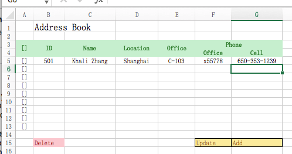

# AddressBook

Online demo address: [https://yakima-teng.github.io/address-book/](https://yakima-teng.github.io/address-book/)

This is an AngularJS address book demo which was generated with [Angular CLI](https://github.com/angular/angular-cli) version 1.4.2. This project is created as an answer to an question. And here are the details:



It’s highly preferable to use Angular/AngularJS with as less of other frameworks/libraries as possible. Yet, in case you have no Angular/ AngularJS experience, you can use other frameworks too.

## Requirements:

1. Cell phone column can be edited when double clicked.(done)
2. Clicking the column label would sort the column alphabetically.(done)
3. When the selector of the first column and the first row is checked, all rows are selected.(done)
4. Clicking the Delete button will delete the selected rows.(done)
5. Update will cause the Ajax invocation to update the modified rows. For now, just pop up a alert showing the rows you are to update.(done)
6. Add will add an empty row to fill in the data except the ID, which will be filled after updating.(done)
7. Think of how to localize this.(done, localStorage is employed)

## Also, please answer the following questions for the project:

### Explain how to structure an UI project in MVC model with a simple example.

For me, I used to put all components into a folder, and inject commonly used UI component such as 'alert', 'wait', 'loading', 'confirm' into the root component so that you donot need to import them in many files to use them. UI componets not so commonly used are imported into specific component where they are required. For exmaple, in file app.component.html, I will add pseudocode like this:
```html
<div class="app-facilities">
  <app-alert></app-alert>
  <app-wait></app-wait>
  <app-wait></app-wait>
</div>
```
They are not visible at first. When required to be displayed, revise style of their outtest tag (e.g. display: block;).

### Explain how AngularJS directive is used, and give a couple of use cases.

There are three kinds of directives in Angular.
1. Components - directives with a template.
2. Structural directives - change the DOM layout by adding and removing DOM elements.
3. Attribute directives - change the appearance or behavior of an element, component, or another directive.

Components are the most common to see. In this project, the following files are used as components:
- /src/app/book/book.component;
- /src/app/note/note.component;
- /src/app/app.component;
Because I'm using angular router module, the first two components are registered in file /src/app/app.module (details can be seen in file /src/app/app-routing/app-routing.module). The last and also the root component are used in /index.html as below:
```html
<app-root></app-root>
```


Structural directives are directives like NgFor and NgIf, use case of NgFor can be seen in file /src/app/book/book.component.html:
```html
<tr
  *ngFor="let item of addresses"
  [class.selected]="isAllRowFieldsSelected(item.fields)"
  class="row row-body">
  ... other code here
```

I defined an attribute directive in file /src/app/book/toggle-disable.directive.ts, and you can find its usage in file /src/app/book/book.component.html as below (appToggleDisable is the directive I refer to):
```html
<input
  type="text"
  class="field-text"
  readonly="readonly"
  appToggleDisable
  [(ngModel)]="item.fields.phoneCell.value"
  placeholder="cell phone">
```


### Explain how AngularJS scope is defined, and give a couple of use cases.

NgModules help organize an application into cohesive blocks of functionality. It's usually recommended to creating and maintaining a single root AppModule for the entire application if it's not quite a big project.
An NgModule is a class decorated with @NgModule.
Components (also a kind of directives), directives, services and etc. should be injected into the root module, so that all of them will be available for use anywhere in the application.
Components, directives, and services registered into one module is local to that module.

## Development server

Run `ng serve` for a dev server. Navigate to `http://localhost:4200/`. The app will automatically reload if you change any of the source files.

## Code scaffolding

Run `ng generate component component-name` to generate a new component. You can also use `ng generate directive|pipe|service|class|guard|interface|enum|module`.

## Build

Run `ng build` to build the project. The build artifacts will be stored in the `dist/` directory. Use the `-prod` flag for a production build.

## Running unit tests

Run `ng test` to execute the unit tests via [Karma](https://karma-runner.github.io).

## Running end-to-end tests

Run `ng e2e` to execute the end-to-end tests via [Protractor](http://www.protractortest.org/).
Before running the tests make sure you are serving the app via `ng serve`.

## Further help

To get more help on the Angular CLI use `ng help` or go check out the [Angular CLI README](https://github.com/angular/angular-cli/blob/master/README.md).
